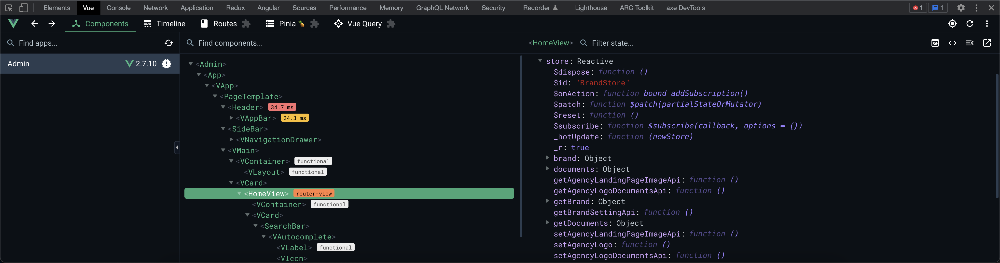
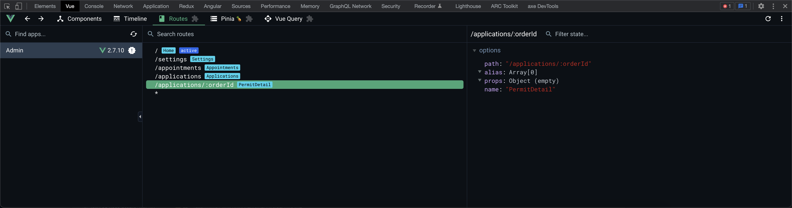
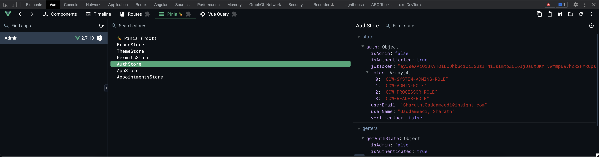
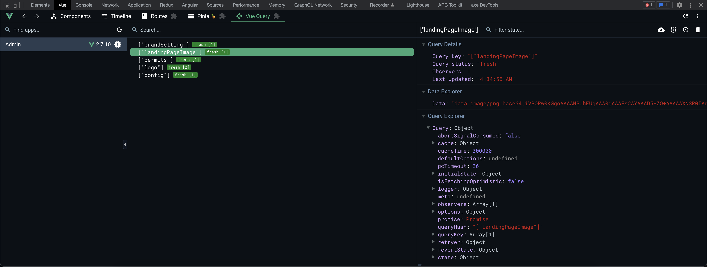

## Vue Composition with Pinia store management and Vue-Query brings us a very powerful combination of dev tools which makes debugging and inspecting the application extremely quick.

> Please install Vue dev tools and Vue force extensions in your browser.

#### Vue Devtools for inspecting Components, Props, State etc

#### Vue Devtools for inspecting Routes, Params etc

#### Vue Devtools for inspecting Pinia stores

#### Vue Devtools for inspecting Vue-Query HTTP requests

