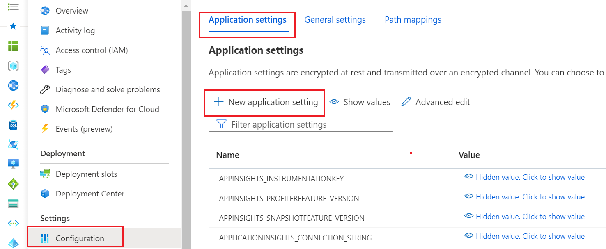

# CSSA CCW Web API

## Web API Project Structure

Each API project has same structure except for Clients folder found in Application and Document APIs. These projects have dependencies on some of the other projects and the Clients folder holds those client classes.

### Controllers Folder

This folder should hold all Web API Controllers. It is best to create separate controllers as needed to align functionality.

### Entities Folder

This folder shold hold the database models (entities) the API is responsible for.

### Enums Folder

This folder should hold all Enums required by the API.

### Mappers Folder

This folder should hold all mapper classses needed by the API. These API use custom mappers to ensure the data is serialized or deserialized based on request/response needs.

### Models Folder

This folder should hold any request/response models required/used by the UI. Request/response models should be used to isolate the underlying database models from the UI requirements.

### Services Folder

The Services folder should hold any "services" the API needs like database or storage.

CosmosDbService Class for Example

- Contains all functions that allow CRUD & other required methods to be performed on the database.
- Database name and container is found the appsettings.Development.json (for local) and under App Service Configuration in Azure.
- How to add a new method modify:
    1. Add a new method to the interface: ICosmosDbService.cs
    2. Implement in the CosmosDbServiceClass

## Managing Application Configuraton Settings

When developing new functionality it is often needed to add configuration data. It is important to remember that these settings need to be configured for local, dev, & Azure Marketplace deployments.

How to add a new settings:

1. Update relevant appsettings.Development.json section with the new setting for local development. Run and test your changes locally.
    - **DO NOT check-in sensitive or secret settings!**. Use local secrets: [Visual Studio - Managing local secrets](https://learn.microsoft.com/en-us/aspnet/core/security/app-secrets?view=aspnetcore-7.0&tabs=windows)
2. Navigate to Azure App Service corresponding to API service you are looking to modify, go to Configuration -> Application settings and enter new setting.
    - Use double underscore "parent__child" to define nested settings in a Linux environment.
    - With Windows hosting you would use a colon "parent:child".
    - Keep in mind that CCW implments Linux App Services.
3. These settings should be configured in the [IaC](../../Deployment/IaC) as well so that they get deployed with the system.

### App Settings Example

||
|---|

||
|---|
